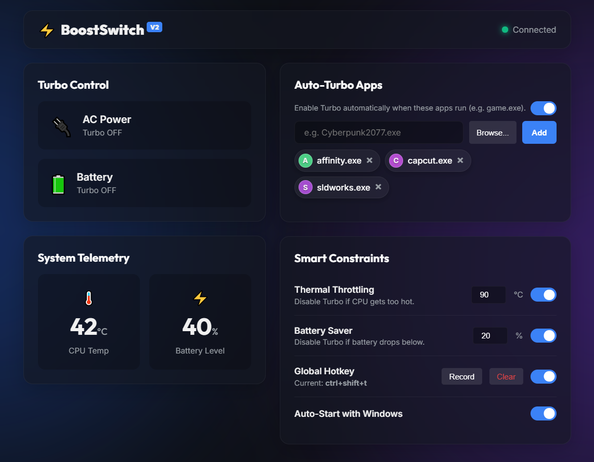

# BoostSwitch V2 ⚡

A lightweight, minimalist Python application to toggle **Processor Performance Boost Mode** (Turbo Boost) on Windows. Useful for saving battery or reducing heat/fan noise without digging through confusing power plan settings. Now completely revamped with a modern Web UI and advanced automation features.




> **Note:** This application is primarily designed and tested for laptops with **AMD APU (Ryzen)** processors. While it may work on some Intel systems depending on their power management implementation, full compatibility is not guaranteed.

## Features 🚀
- **Modern Web Interface:** A beautiful, responsive, glass-morphism dashboard served locally via Flask.
- **Auto-Turbo Apps:** Automatically enables Turbo when specified applications (e.g., games, heavy workloads) are running. Easily add trigger apps by dragging and dropping `.exe` files into the dashboard or pasting via `Ctrl+V`.
- **Smart Battery Saver:** Automatically disables Turbo when your laptop battery drops below a configurable percentage.
- **Thermal Throttling Control:** Continuously monitors CPU temps (using a universally robust sensor heuristic) and disables Turbo if the hardware gets too hot.
- **System Tray Integration:** Runs silently in the background. Right-click the tray icon for quick toggles and real-time telemetry.
- **Reveal Hidden Windows Settings:** Bring the "Processor performance boost mode" setting out of hiding in your Windows Power Options with a single click in the tray menu.
- **Global Hotkeys:** Toggle Turbo from anywhere using a custom keybind.
- **Auto-Start:** Seamlessly boot with Windows.

## How It Works ⚙️
It modifies the **Processor performance boost mode** setting in the active power plan via `powercfg`.
- **Turbo ON:** Sets mode to `Aggressive` (Index: 2) -> CPU boosts as needed for performance.
- **Turbo OFF:** Sets mode to `Disabled` (Index: 0) -> CPU sticks to base block for efficiency.

## Installation & Usage 📦

### Running from Source
1. Install dependencies (we recommend setting up a virtual environment):
   ```bash
   pip install -r requirements.txt
   ```
2. Run the application:
   ```bash
   python app.py
   ```

### Building Executable
To create a standalone `.exe` without console windows and packaging all required web assets:
```bash
pyinstaller --noconsole --onefile --icon=icon.ico --add-data "icon.ico;." --add-data "icons;icons" --add-data "templates;templates" --add-data "static;static" app.py
```

## Requirements
- Windows 10/11
- Python 3.10+
